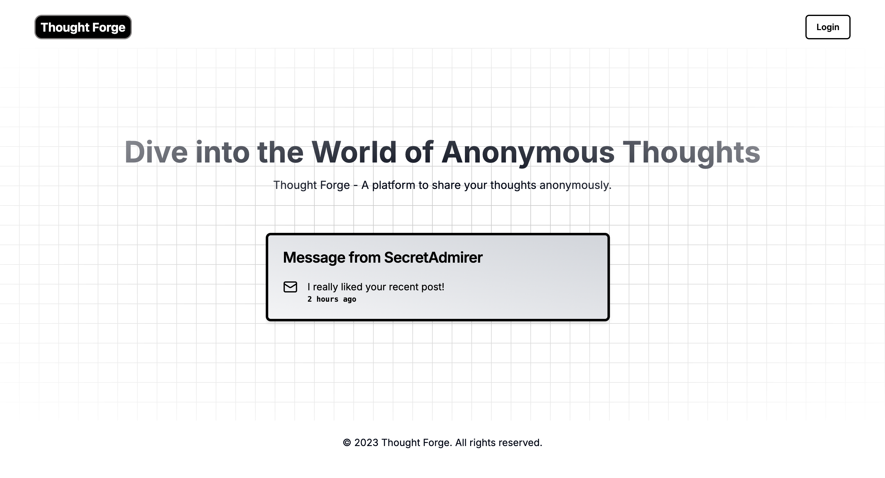
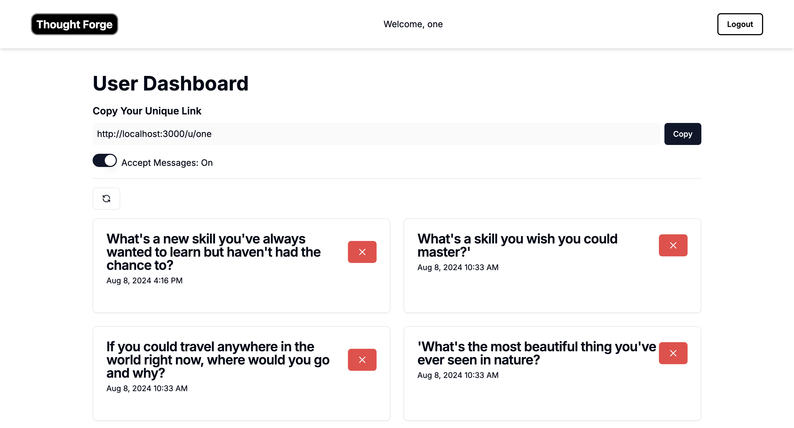
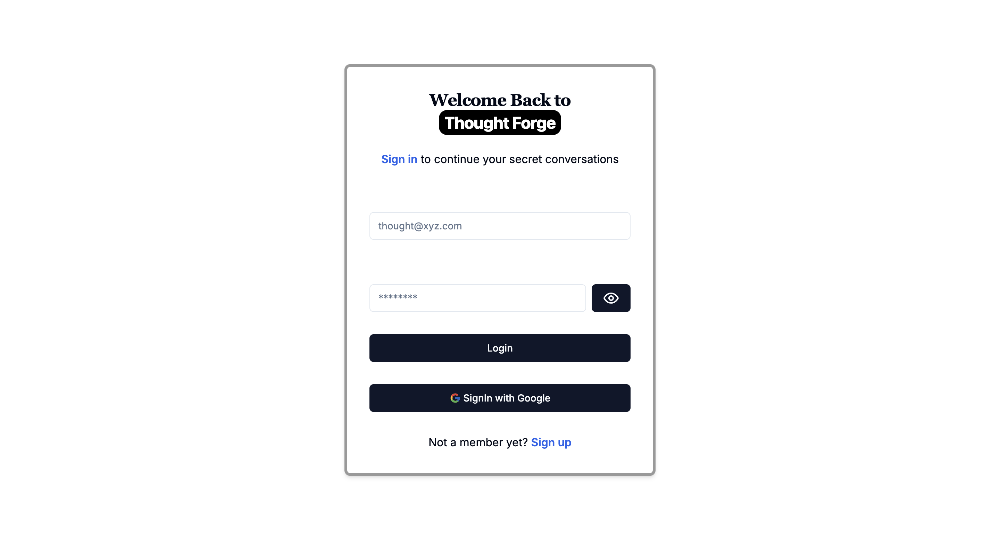
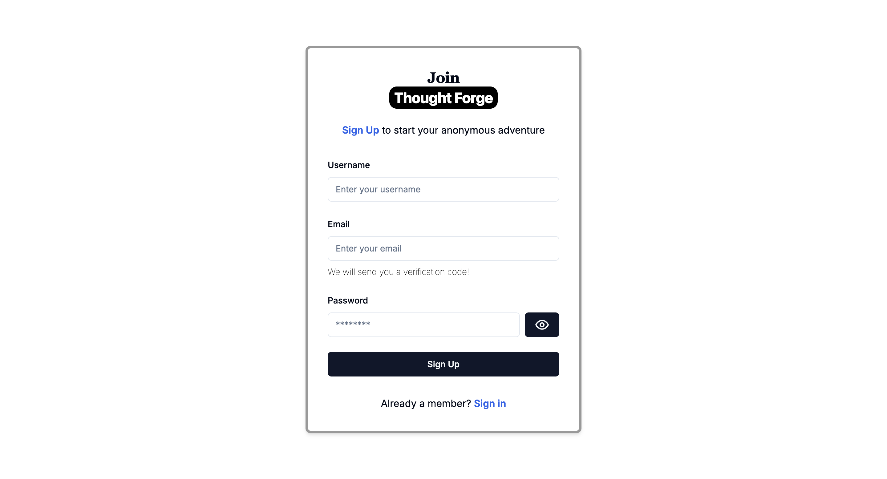
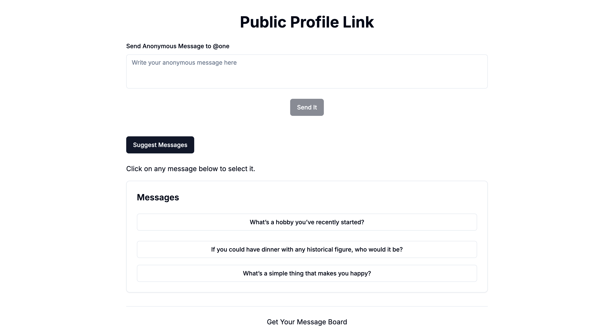

<a name="readme-top"></a>


[![Contributors][contributors-shield]][contributors-url]
[![Forks][forks-shield]][forks-url]
[![Stargazers][stars-shield]][stars-url]
[![Issues][issues-shield]][issues-url]
[![MIT License][license-shield]][license-url]
[![LinkedIn][linkedin-shield]][linkedin-url]


<!-- LOGO -->
<br />
<div align="center">
  <a href="https://github.com/falgunmpatel/thought-forge">
    
  </a>
</div>


<!-- TABLE OF CONTENTS -->
<details>
  <summary>Table of Contents</summary>
  <ol>
    <li>
      <a href="#about-the-project">About The Project</a>
      <ul>
        <li><a href="#demo-credentials">Demo Credentials</a></li>
      </ul>
      <ul>
        <li><a href="#built-with">Built With</a></li>
      </ul>
    </li>
    <li>
      <a href="#getting-started">Getting Started</a>
      <ul>
        <li><a href="#prerequisites">Prerequisites</a></li>
        <li><a href="#installation">Installation</a></li>
      </ul>
    </li>
    <li><a href="#contributing">Contributing</a></li>
    <li><a href="#license">License</a></li>
    <li><a href="#contact">Contact</a></li>
    <li><a href="#acknowledgments">Acknowledgments</a></li>
  </ol>
</details>


<!-- ABOUT THE PROJECT -->
<a name="about-the-project"></a>
## About The Project

### 🚀 Thought Forge 📝
Thought Forge is an innovative platform designed to provide users with a space for receiving anonymous messages. Built with a modern stack including Shadcn/UI, Aeternity UI, Next.js, NextAuth.js, React-Hook-Forms, and Google Generative AI, this platform offers a seamless user experience with intuitive functionality.

🔑 Key Features
* User Authentication: Users can easily sign in or sign up, powered by NextAuth.js, ensuring secure and hassle-free access to their accounts.
* Dynamic Dashboard: After signing in, users are directed to their personalized dashboard, where they can view, refresh, and manage messages from anonymous users.
* Message Management: Users can enable or disable message reception, read incoming messages, delete unwanted ones, and refresh their dashboard for new updates.
* Public Message Link: Every user gets a public link to share, allowing others to send anonymous messages without the need to sign in or create an account.
* AI-Powered Message Suggestions: Senders have the option to write custom messages or choose from AI-generated suggestions, powered by Google Generative AI, for a seamless and interactive experience.


<p align="right">(<a href="#readme-top">back to top</a>)</p>

<a name="demo-credentials"></a>
### 🪪 Demo Credentials
username: falgunmpatel9123@gmail.com <br />
password: thoughtforge

<p align="right">(<a href="#readme-top">back to top</a>)</p>

<a name="built-with"></a>
### 💻 Technologies Used
1. FullStack: Next.js
2. Authentication: NextAuth.js
3. UI Components: shadcn/ui + Aceternity UI
4. Message Suggestions: Google Generative AI (Gemini)


<p align="right">(<a href="#readme-top">back to top</a>)</p>

### Screenshots: 

<figure>
  
  <figcaption> Home Page</figcaption>
</figure>

<figure>  
  <figcaption> User's Dashboard</figcaption>
</figure>


<figure>  
  <figcaption> Sign In Page</figcaption>
</figure>

<figure>  
  <figcaption> Sign Up Page</figcaption>
</figure>

<figure>  
  <figcaption> Suggest Message Page</figcaption>
</figure>


<!-- GETTING STARTED -->
<a name="getting-started"></a>
## Getting Started

<a name="prerequisites"></a>
### Prerequisites
Basic knowledge of **React** is required to setup this project.

Download latest version of npm here:
* npm
 ```sh
  npm install npm@latest
  ```
**NOTE**: I used npm version @10.5.0 while creating this project

<a name="installation"></a>
### Installation
1. Clone the repo
   ```sh
   git clone https://github.com/falgunmpatel/thought-forge
   ```
2. Install NPM packages
   ```sh
   npm install
   ```
3. Create a .env file in the root directory of the project and add following content to it
    ```.env.sample
    MONGODB_URI=
    RESEND_API_KEY=
    AUTH_SECRET=
    NEXTAUTH_SECRET=
    GOOGLE_GenAI_API_KEY=
    AUTH_GOOGLE_ID=
    AUTH_GOOGLE_SECRET=
    ```

    or you can do it by this command

    ```
    cp ./.env.sample ./.env  
    ```

    <blockquote>
    NOTE: <br />
    1. Go to <a href="https://aistudio.google.com">Google AI Studio</a>, Sign In andcreate your API Key. <br />
    2. Go to <a href="https://console.cloud.google.com">Google Cloud Console</a>, Sign In -> Click on Apis and Services and create authentication credentials. 
    3. Finally, You need to copy these credentials in the .env file for proper functioning of this project. 
    You may use NextAuth Secret of your choice.
    </blockquote>

4. Run the project by running the following command in the root directory of the project
    ```sh
      npm run dev
    ```

<p align="right">(<a href="#readme-top">back to top</a>)</p>


<!-- CONTRIBUTING -->
<a name="contributing"></a>
## Contributing

Contributions are what make the open source community such an amazing place to learn, inspire, and create. Any contributions you make are **greatly appreciated**.

If you have a suggestion that would make this better, please fork the repo and create a pull request. You can also simply open an issue with the tag "enhancement".
Don't forget to give the project a star! Thanks again!

1. Fork the Project
2. Create your Feature Branch (`git checkout -b feature/AmazingFeature`)
3. Commit your Changes (`git commit -m 'Add some AmazingFeature'`)
4. Push to the Branch (`git push origin feature/AmazingFeature`)
5. Open a Pull Request

<p align="right">(<a href="#readme-top">back to top</a>)</p>


<!-- LICENSE -->
<a name="license"></a>
## License

Distributed under the MIT License. See `LICENSE.txt` for more information.

<p align="right">(<a href="#readme-top">back to top</a>)</p>


<!-- CONTACT -->
<a name="contact"></a>
## Contact

Name - Falgun Patel
Email - falgunmpatel9123@gmail.com

Project Link: [thought-forge](https://github.com/falgunmpatel/rapid-write)

<p align="right">(<a href="#readme-top">back to top</a>)</p>


<!-- ACKNOWLEDGMENTS -->
<a name="acknowledgement"></a>
## Acknowledgments

  1. **Next.js Playlist** @[ChaiAurCode](https://www.youtube.com/@chaiaurcode) <br/>
      **Mentor**: [Hitesh Choudhary](https://github.com/hiteshchoudhary)

  2. **Full Stack**: [Next.js](https://nextjs.org/)

  3. **Forms**: Docs @[React-Hook-Forms](https://react-hook-form.com/)

  4. **UI Components**: [shadcn/ui](https://ui.shadcn.com/), [Aceternity UI](https://ui.aceternity.com/)

  5. **Authentication**: [NextAuth.js](https://next-auth.js.org/)


<p align="right">(<a href="#readme-top">back to top</a>)</p>


<!-- MARKDOWN LINKS & IMAGES -->
[contributors-shield]: https://img.shields.io/github/contributors/falgunmpatel/rapid-write.svg?style=for-the-badge
[contributors-url]: https://github.com/falgunmpatel/rapid-write/graphs/contributors
[forks-shield]: https://img.shields.io/github/forks/falgunmpatel/rapid-write.svg?style=for-the-badge
[forks-url]: https://github.com/falgunmpatel/rapid-write/network/members
[stars-shield]: https://img.shields.io/github/stars/falgunmpatel/rapid-write.svg?style=for-the-badge
[stars-url]: https://github.com/falgunmpatel/rapid-write/stargazers
[issues-shield]: https://img.shields.io/github/issues/falgunmpatel/rapid-write.svg?style=for-the-badge
[issues-url]: https://github.com/falgunmpatel/rapid-write/issues
[license-shield]: https://img.shields.io/github/license/falgunmpatel/rapid-write.svg?style=for-the-badge
[license-url]: https://github.com/falgunmpatel/rapid-write/blob/master/LICENSE
[linkedin-shield]: https://img.shields.io/badge/-LinkedIn-black.svg?style=for-the-badge&logo=linkedin&colorB=555
[linkedin-url]: https://linkedin.com/in/falgunmpatel